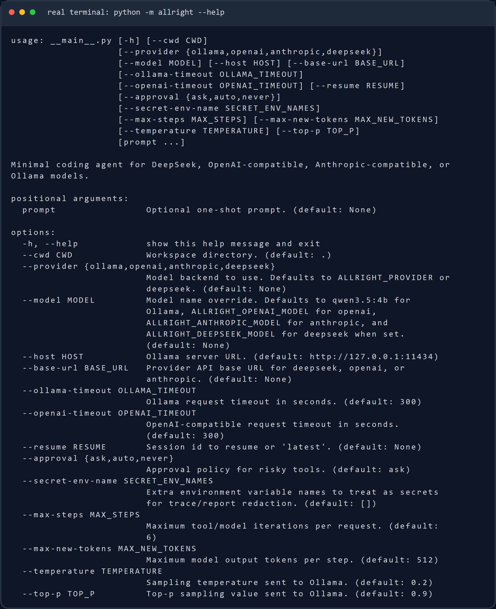
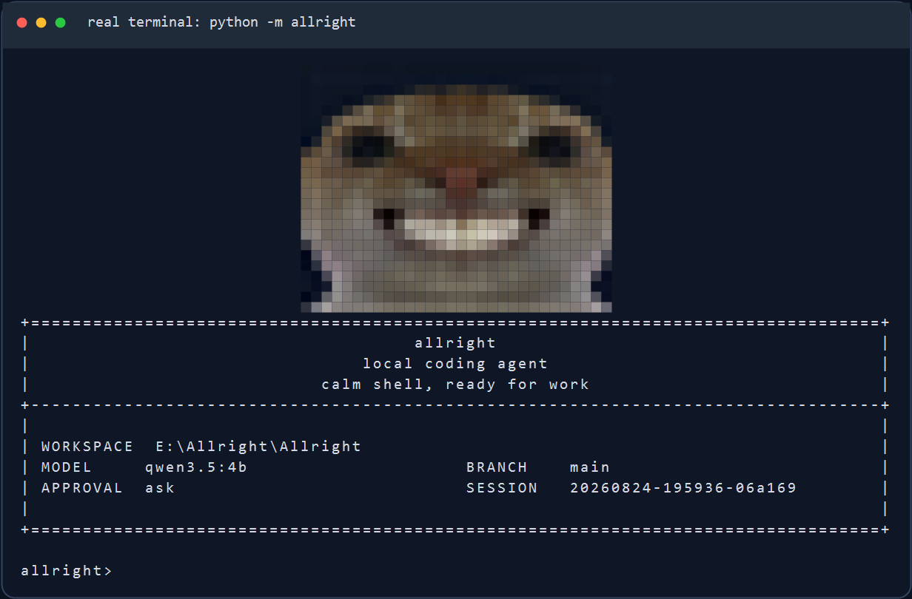
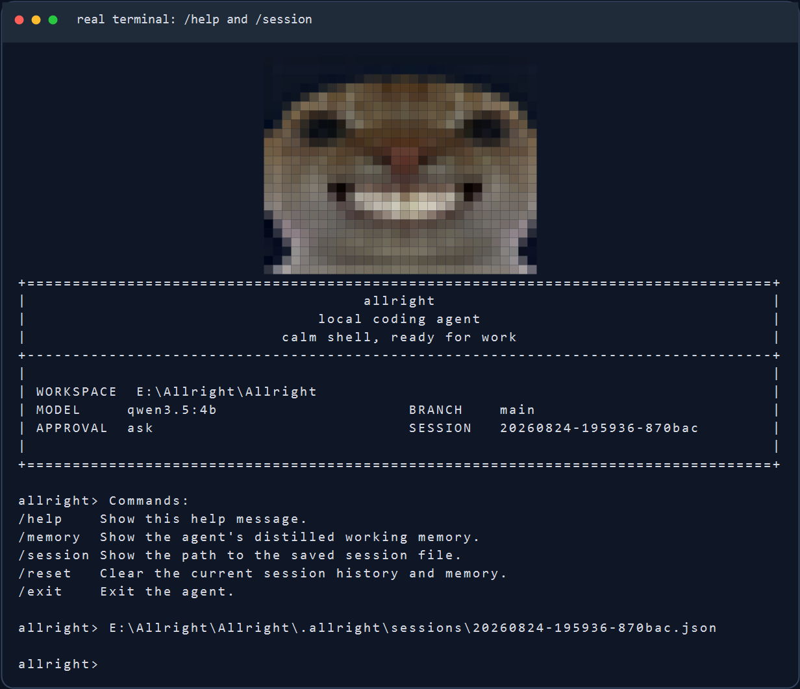

# Allright

`Allright` 是一个面向代码仓库长链路任务的本地 coding agent harness。项目围绕模型接入、受约束工具调用、上下文管理、任务恢复、结构化记忆、运行审计和评测闭环进行系统化设计，让 agent 能够在真实工作区中持续完成代码排查、测试修复、仓库分析与工程改动。

Allright 重点解决多轮任务中常见的 prompt 膨胀、重复读取文件、执行状态丢失、工具副作用不可控以及结果难以复盘等问题。它直接运行在终端中，以当前仓库为事实来源，将会话、检查点、记忆和每次运行的审计工件统一保存在本地 `.allright/` 目录，而不是停留在一次性的聊天交互。

## 适合做什么

- 在本地仓库里完成多轮排查、修改和测试验证
- 基于真实代码结构构建有边界的模型上下文
- 通过显式工具白名单与审批策略控制读写和命令副作用
- 从会话与检查点恢复任务，减少重复读文件和状态丢失
- 通过结构化 trace、report 与 benchmark 复盘运行结果

## 主要特性

- 有界上下文：按稳定前缀、结构化记忆、历史记录和当前请求组装 prompt
- 任务恢复：保存会话、任务状态和检查点，识别工作区或运行时身份变化
- 受控工具：通过工具白名单、路径约束和审批模式限制高风险副作用
- 结构化记忆：将可复用的项目约定、依赖事实和关键决策沉淀为主题记忆
- 可审计运行：为每次执行输出 task state、JSONL trace 和结构化 report
- 评测闭环：内置固定 coding tasks、回归实验、消融指标和可复现实验工件
- 多模型接入：统一支持 DeepSeek、OpenAI-compatible、Anthropic-compatible 与 Ollama
- 工程入口：CLI 为 `allright`，模块入口为 `python -m allright`
- 本地状态：会话位于 `.allright/sessions/`，运行工件位于 `.allright/runs/<run_id>/`
- 支持四类模型后端：
  - Ollama
  - OpenAI 兼容 Responses API
  - Anthropic 兼容 Messages API
  - DeepSeek Anthropic 兼容 API

## 使用截图

以下截图由本仓库代码实际运行后捕获，终端内容、工作区路径、状态信息和 session ID 均来自真实 CLI 输出。

CLI 帮助信息：



启动界面：



REPL 内置命令与会话路径：



### 三态终端吉祥物

Allright 会根据当前运行状态切换启动吉祥物：

- normal：provider 配置完整、程序正常运行时显示咧嘴猫
- offline：缺少 API Key，或模型请求遇到网络、超时、401/403 与鉴权问题时显示发呆猫
- error：模型响应解析等其他运行错误时显示受伤猫

Kitty、iTerm2 和 WezTerm 会优先使用原生终端图片协议；其他现代终端使用由同一张 PNG 生成的 ANSI true-color 字符图。重定向输出或 CI 中默认不显示吉祥物，避免污染日志。

可以通过环境变量控制渲染：

    # 禁用吉祥物
    ALLRIGHT_MASCOT=off allright

    # 强制选择渲染协议：ansi / kitty / iterm / off
    ALLRIGHT_MASCOT_PROTOCOL=ansi allright

## 安装

需要 Python 3.10+。

如果你用 `uv`，直接安装依赖：

```bash
uv sync
```

如果你已经在自己的 Python 环境里工作，也可以直接装成可编辑模式：

```bash
pip install -e .
```

## 快速开始

在当前仓库里启动交互模式。默认 provider 是 DeepSeek：

```bash
uv run allright
```

指定另一个工作目录：

```bash
uv run allright --cwd /path/to/repo
```

直接跑一次性任务：

```bash
uv run allright "inspect the test failures and propose a fix"
```

如果当前环境已经安装过包，也可以直接这样启动：

```bash
python -m allright
```

## 模型后端

Allright 启动时会读取项目根目录的 `.env`。本地真实 key 放在 `.env`，仓库只保留 `.env.example`。配置优先级是：

```text
显式 CLI 参数 > .env 里的 ALLRIGHT_* 变量 > 旧环境变量 > 代码默认值
```

Provider 选择的具体顺序是：

```text
--provider > ALLRIGHT_PROVIDER > 代码默认 deepseek
```

不传 `--provider` 且没有 `ALLRIGHT_PROVIDER` 时默认使用 `deepseek`。这是推荐配置路径：DeepSeek 的 Anthropic-compatible endpoint 比本地 Ollama 更少依赖本机模型环境，也比 OpenAI-compatible/Anthropic-compatible 代理少一层默认 gateway 假设。其他 provider 仍然保留，可以在 `.env` 里写 `ALLRIGHT_PROVIDER=openai`、`ALLRIGHT_PROVIDER=anthropic`、`ALLRIGHT_PROVIDER=ollama`，也可以显式传 `--provider openai`、`--provider anthropic` 或 `--provider ollama`。

`.env` 会在构建 provider client 前加载，并覆盖当前进程里的同名环境变量。模型名和 base URL 可以通过 `--model`、`--base-url` 临时覆盖；API key 只从环境变量读取。

本地第一次配置：

```bash
cp .env.example .env
```

然后把要使用的 provider key 填进去。`.env` 已经被 `.gitignore` 忽略，不要提交真实 key。

### 推荐配置：DeepSeek

最小配置只需要 key：

```bash
ALLRIGHT_DEEPSEEK_API_KEY="your-api-key"
```

默认模型和接口是：

```bash
ALLRIGHT_DEEPSEEK_API_BASE="https://api.deepseek.com/anthropic"
ALLRIGHT_DEEPSEEK_MODEL="deepseek-v4-pro"
```

所以常规情况下 `.env` 里只填 `ALLRIGHT_DEEPSEEK_API_KEY` 就能直接启动：

```bash
uv run allright
```

如果你需要临时切模型或代理地址，不必改 `.env`，可以直接覆盖：

```bash
uv run allright --model deepseek-v4-pro --base-url https://api.deepseek.com/anthropic
```

DeepSeek 当前走 Anthropic-compatible Messages API，所以 runtime 里复用的是 Anthropic-compatible client；这只影响 HTTP 协议，不影响 CLI 用法。

Allright 当前使用文本编码的工具协议，因此会在 DeepSeek 请求中显式关闭 provider-native thinking，避免思考内容耗尽单步输出预算或产生无法回放的 thinking block。后续如果接入原生工具协议，需要同时实现 thinking block 的完整回放，不能只删除这个开关。

### 可选配置：right.codes

right.codes 在 Allright 里有两条可选 provider 路径：

- `--provider openai`：走 OpenAI-compatible `/responses`，默认 base URL 是 `https://www.right.codes/codex/v1`，默认模型是 `gpt-5.4`
- `--provider anthropic`：走 Anthropic-compatible `/messages`，默认 base URL 是 `https://www.right.codes/claude/v1`，默认模型是 `claude-sonnet-4-6`

如果 right.codes 给你的是一把共享 key，推荐只填这一项：

```bash
ALLRIGHT_RIGHT_CODES_API_KEY="your-right-codes-key"
```

然后按需要选择 provider：

```bash
uv run allright --provider openai
uv run allright --provider anthropic
```

如果你想显式区分两条 provider 的 key，也可以分别配置：

```bash
ALLRIGHT_OPENAI_API_KEY="your-right-codes-key-for-codex"
ALLRIGHT_ANTHROPIC_API_KEY="your-right-codes-key-for-claude"
```

不要在 `.env` 里写 `ALLRIGHT_OPENAI_API_KEY=$ALLRIGHT_RIGHT_CODES_API_KEY` 这种 shell 展开形式；Allright 的 `.env` 解析器只读取字面量，不展开变量引用。要么只写 `ALLRIGHT_RIGHT_CODES_API_KEY`，要么把 key 字符串分别填到 provider-specific 变量里。

如果请求 right.codes 返回 `API Key额度不足`，说明协议和 endpoint 已经打通，但当前 key 没有可用额度；换一把有额度的 key，或到 right.codes 后台处理额度。

当前 provider 环境变量：

| provider | base URL | API key | model |
| --- | --- | --- | --- |
| `deepseek` | `ALLRIGHT_DEEPSEEK_API_BASE`，回退 `DEEPSEEK_API_BASE`，默认 `https://api.deepseek.com/anthropic` | `ALLRIGHT_DEEPSEEK_API_KEY`，回退 `DEEPSEEK_API_KEY` | `ALLRIGHT_DEEPSEEK_MODEL`，回退 `DEEPSEEK_MODEL`，默认 `deepseek-v4-pro` |
| `openai` | `ALLRIGHT_OPENAI_API_BASE`，回退 `OPENAI_API_BASE`，默认 `https://www.right.codes/codex/v1` | `ALLRIGHT_OPENAI_API_KEY`，回退 `OPENAI_API_KEY`、`ALLRIGHT_RIGHT_CODES_API_KEY`、`RIGHT_CODES_API_KEY`、`ALLRIGHT_ANTHROPIC_API_KEY`、`ANTHROPIC_API_KEY` | `ALLRIGHT_OPENAI_MODEL`，回退 `OPENAI_MODEL`，默认 `gpt-5.4` |
| `anthropic` | `ALLRIGHT_ANTHROPIC_API_BASE`，回退 `ANTHROPIC_API_BASE`，默认 `https://www.right.codes/claude/v1` | `ALLRIGHT_ANTHROPIC_API_KEY`，回退 `ANTHROPIC_API_KEY`、`ALLRIGHT_RIGHT_CODES_API_KEY`、`RIGHT_CODES_API_KEY`、`ALLRIGHT_OPENAI_API_KEY`、`OPENAI_API_KEY` | `ALLRIGHT_ANTHROPIC_MODEL`，回退 `ANTHROPIC_MODEL`，默认 `claude-sonnet-4-6` |
| `ollama` | `--host`，默认 `http://127.0.0.1:11434` | 不需要 | `--model`，默认 `qwen3.5:4b` |

如果有额外的敏感环境变量需要从 trace/report 里脱敏，可以用 `ALLRIGHT_SECRET_ENV_NAMES` 配置逗号分隔的变量名，或启动时重复传 `--secret-env-name NAME`。

### OpenAI 兼容接口

如果要改用 OpenAI-compatible `/responses` 服务，显式传 `--provider openai`：

```bash
uv run allright --provider openai
```

默认 OpenAI 兼容接口使用 right.codes 的 Codex endpoint：

```bash
ALLRIGHT_OPENAI_API_BASE="https://www.right.codes/codex/v1"
ALLRIGHT_RIGHT_CODES_API_KEY="your-right-codes-key"
ALLRIGHT_OPENAI_MODEL="gpt-5.4"
```

也可以改成其他 OpenAI-compatible 服务：

```bash
ALLRIGHT_OPENAI_API_BASE="https://your-api.example/v1"
ALLRIGHT_OPENAI_API_KEY="your-api-key"
ALLRIGHT_OPENAI_MODEL="gpt-5.4"
```

### Anthropic 兼容接口

如果要改用 Anthropic-compatible 服务，显式传 `--provider anthropic`：

```bash
uv run allright --provider anthropic
```

默认 Anthropic 兼容接口使用 right.codes 的 Claude endpoint：

```bash
ALLRIGHT_ANTHROPIC_API_BASE="https://www.right.codes/claude/v1"
ALLRIGHT_RIGHT_CODES_API_KEY="your-right-codes-key"
ALLRIGHT_ANTHROPIC_MODEL="claude-sonnet-4-6"
```

如果你的服务端对多个兼容接口复用了同一套密钥，`allright` 也支持从 `ALLRIGHT_ANTHROPIC_API_KEY` 回退到 `ANTHROPIC_API_KEY`、`ALLRIGHT_RIGHT_CODES_API_KEY`、`RIGHT_CODES_API_KEY`、`ALLRIGHT_OPENAI_API_KEY` 或 `OPENAI_API_KEY`。

### Ollama

如果要改用本地 Ollama，显式传 `--provider ollama`：

```bash
ollama serve
ollama pull qwen3.5:4b
uv run allright --provider ollama --model qwen3.5:4b
```

## 常用交互命令

- `/help`：查看内置命令
- `/memory`：查看提炼后的工作记忆
- `/session`：查看当前会话文件路径
- `/reset`：清空当前会话状态
- `/exit` 或 `/quit`：退出 REPL

## 安全与持久化

`allright` 不会默认把所有动作都放开。像 shell 执行、文件写入这类高风险操作，会受审批模式控制：

- `--approval ask`
- `--approval auto`
- `--approval never`

每次运行结束后，都会在 `.allright/runs/<run_id>/` 下写出这些文件：

- `task_state.json`
- `trace.jsonl`
- `report.json`

这些内容默认只保存在本地，不需要跟仓库一起提交。

## 开发

常用本地检查：

```bash
uv run pytest tests -q
uv run ruff check allright tests scripts
```

内部代码现在按较轻的边界拆分：`allright/evaluation/` 放 benchmark 和 metrics，`allright/providers/` 放模型 provider client，`allright/features/` 放可选运行时能力。新代码应直接使用这些包路径；旧的 `allright.evaluator`、`allright.metrics`、`allright.models` 和 `allright.memory` import 不再作为公共入口保留。
